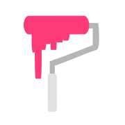

<h1 align="center">

<br>
Pitch
</h1>


<p align="center">
<a href="https://nnda.itch.io/pitch/" target="_blank"></a>
<br>
<br>
Collection of CSS components and tweaks designed specifically for itch.io project pages.
</p>


## Features

- Automatically match your page's theme
- Responsive design that adapts to different screen sizes
- Free and open source under AGPLv3 and CC0 license

## Installation

```sh
# Install the dependencies
npm install

# Run the development server at localhost:8080
npm run start

# Build the app to dist/
npm run build
```

## Licenses

- The Pitch web app is licensed under [AGPLv3](LICENSE).
- The CSS components are licensed under [CC0](LICENSE-CC0).

Copyright &copy; 2025 nnda
