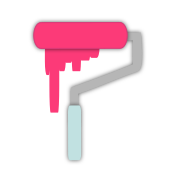

<h1 align="center">

<br>
Pitch
</h1>

<p align="center">
<a href="https://nnda.itch.io/pitch/"></a>
</p>

<br>

<p align="center">
  Catalogue of CSS components, decorations, and tweaks, designed specifically for itch.io pages.
</p>

<br>


<br>
<br>

> [!CAUTION]
> Pitch is currently migrating to the Svelte framework and Vite build system.
> The current state of the app is incomplete,
> and there will be breaking changes and bugs in the `main` and `dev` branch.


## Features

- Automatically match your page's theme
- Responsive design that adapts to different screen sizes
- Free and open source under AGPLv3 and CC0 license

## Installation

```sh
# Install the dependencies
bun install

# Run the development server at localhost:5173
bun run dev

# Build the app to dist/
bun run build
```

## Licenses

- The Pitch web app is licensed under [AGPLv3](LICENSE).
- The CSS components are licensed under [CC0](LICENSE-CC0).

Copyright &copy; 2026 nnda
